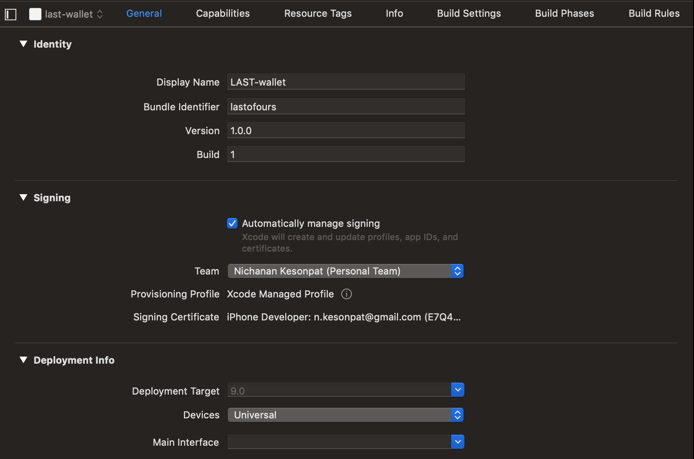
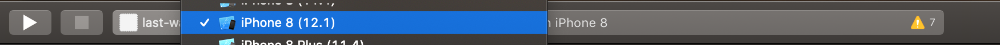

# LAST-Wallet

## Description

⚠️ For internal testing only - not safe for production usage!

 ## 🛠 Setup

If you are in the last-mvp directory, navigate to the wallet directory using `cd LAST-wallet`. Run `npm install` to install dependancies required for the app to run.

Since the app is detached from expo, we must build manually using XCode and Android Studio. If you are running on a device and not a simulator, make sure that your device is connected to the same wifi as your computer.

### 📱 Running on iOS
1. Install [XCode](https://developer.apple.com/xcode/)
2. Run `expo start --ios`
3. Open XCode, on build targets go to "last-wallet" -> General -> Check "Automatically manage signing"

4. Select a simulator with deployment target 9.0+ or select your device if connected

5. Press the play button to open the simulator

### 🤖 Running on Android
1. Install [Android Studio](https://developer.android.com/studio/install)
2. Run `expo start --android`

## ⚙️ Testing

### `npm test`
Runs the [jest](https://github.com/facebook/jest) test runner on the test suite.

### 'npm t -- --coverage'
Runs the test suite with code coverage overview

## ✅ TODOs
- UX/UI
- fix QR display bug
- code comments for dev
- audit secure storage and private keys, switch to `react-native-sensitive info` (?)
- more unit tests
- wallet integration tests
- connect web3 ethers provider with ganache and backend

## 👩🏻‍💻Contributing

## 📄 License